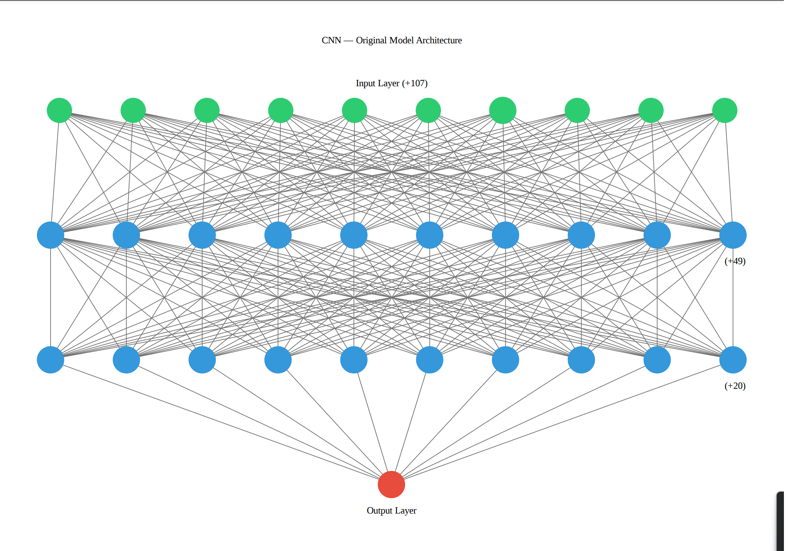

# Alphabet Soup

## Introduction

This analysis analyzes and summarizes the four neural network models to which was designed for Alphabet Soup. The purpose of this analysis is to provide and compare four neural networks in an attempt to predict whether an applicant will become successful.

## Original neural network

## Alternative neural network 1

## Alternative neural network 1

## Alternative neural network 1

